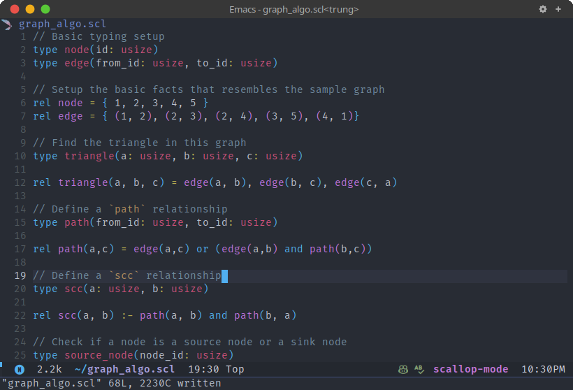

# scallop-mode

Emacs major mode for editing source code of the [Scallop](https://www.scallop-lang.org/) programming language.

## Screenshot

## Installation

- Automatic package installation from [Melpa](https://melpa.org/).

## Features

### Supported

- Syntax highlighting.

- Code indentation.

### Todo

- [ ] Code outline via Imenu
